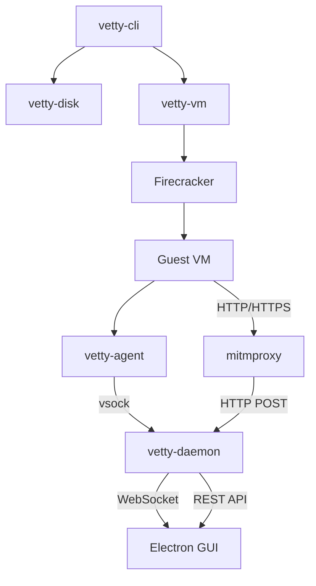
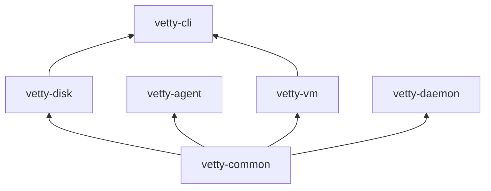

# ARCHITECTURE
This document provides a detailed technical overview of Vetty's architecture for contributors and maintainers.

## System Components

Vetty consists of six Rust crates, a set of guest shell scripts, a Python mitmproxy addon, and an Electron + React GUI.



## Crate Dependency Graph



## Component Details

### vetty-common

**Shared types** used across all crates.

- `SandboxEvent` — The core event struct: timestamp, PID, event type, syscall name, paths, network info, HTTP data
- Event type enum: `file_open`, `file_read`, `file_write`, `process_exec`, `network_connect`, `http_request`, `http_response`, etc.
- Serialization via `serde` for vsock transport and REST API

### vetty-disk

**Builds ext4 disk images** from a host directory.

- Creates a temporary ext4 image using `mkfs.ext4`
- Copies the user's source directory into the image via `debugfs` or mount + copy
- Returns the path to the image file, which is attached to the VM as a second block device (`/dev/vdb`)

### vetty-agent

**Guest-side binary** that runs inside the Firecracker VM.

- Reads `strace` output from a named FIFO (`/tmp/vetty-strace.fifo`)
- Parses strace lines with regex into structured `SandboxEvent`s
- Sends events to the host over a vsock connection (AF_VSOCK, port 52)
- Registers the sandbox with the daemon immediately on boot

### vetty-vm

**Firecracker VM launcher**.

- Starts the `firecracker` process with a Unix socket API
- Configures the VM via Firecracker's REST API: kernel, rootfs drive, code disk drive, network interface, vsock device
- Manages serial console attachment for interactive guest shell access
- Handles TAP network interface setup

### vetty-daemon

**Host-side event ingestion and API server**.

- **vsock listener** — Accepts connections from guest agents via Unix socket proxy, ingests `SandboxEvent` stream
- **REST API** — `GET /api/sandboxes`, `GET /api/sandboxes/:id/events`, `POST /api/proxy-events`
- **WebSocket** — `WS /ws/events` pushes events in real-time to connected GUI clients
- **EventStore** — In-memory store using `DashMap` for concurrent access
- **Proxy backend** — Launches mitmproxy with the custom addon for HTTPS interception

### vetty-cli

**CLI entrypoint** that orchestrates the full pipeline:

1. Validates inputs (directory, rootfs, kernel)
2. Builds code disk image via `vetty-disk`
3. Sets up host network (TAP device, iptables NAT, IP forwarding)
4. Launches Firecracker VM via `vetty-vm`
5. Optionally attaches serial console
6. Cleans up on exit

### Guest Scripts

- **`init.sh`** — Boot script: mounts code disk, starts agent, configures networking + proxy env vars, drops to shell
- **`vetty-run.sh`** — Wrapper that runs a command under `strace`, piping output to the agent's FIFO

### GUI (Electron + React)

- **Electron main process** — Auto-starts daemon if not running, creates window
- **React frontend** — Event timeline, sidebar with sandbox list, filter bar, detail pane with HTTP request/response inspection
- **WebSocket hook** — `useEventStream` connects to daemon and streams events in real-time

## Network Architecture

```
Host: 172.16.0.1/30 (tap0)
Guest: 172.16.0.2/30 (eth0)

Guest → tap0 → iptables NAT MASQUERADE → host's default interface → internet
Guest → HTTP_PROXY=172.16.0.1:8899 → mitmproxy → internet (HTTPS inspected)
```

## Event Flow

```
strace ──FIFO──▶ vetty-agent ──vsock──▶ vetty-daemon ──WebSocket──▶ GUI
                                              ▲
                                              │ HTTP POST
                                        mitmproxy addon
```

Each event is a JSON object flowing through the pipeline, enriched at each stage with sandbox metadata and timestamps.
